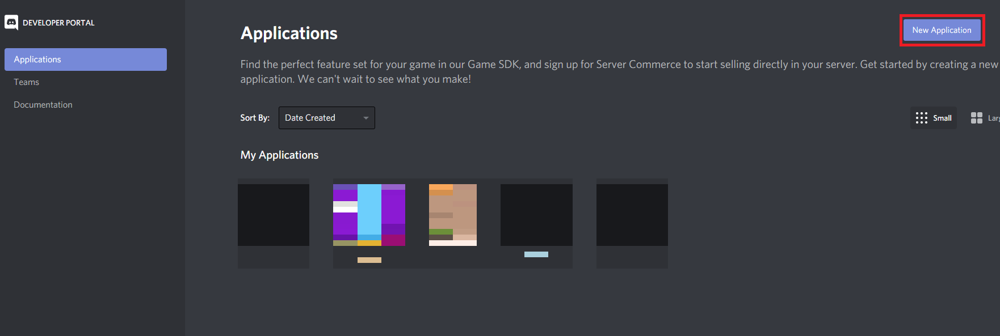
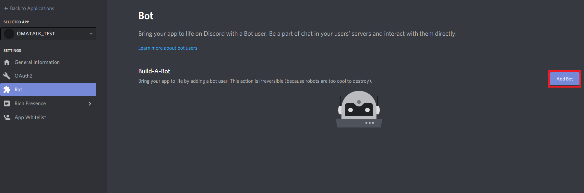
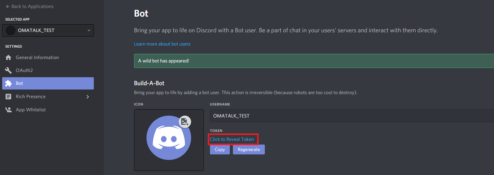
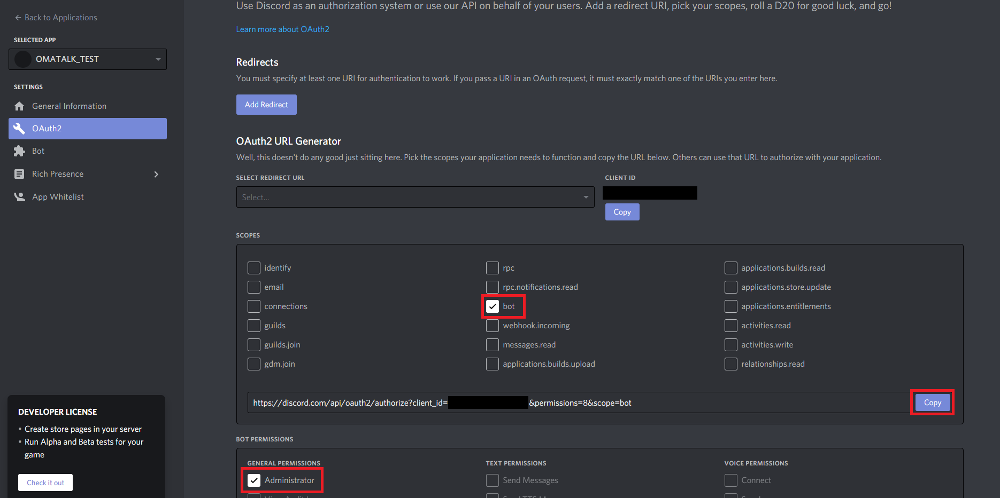

# GOMATALK

Discordのチャットを読み上げるボット。  
https://github.com/omatztw/omatalk をGoでリメイク

## はじめかた

### Discord botの作成

* [Discord developerサイト](https://discord.com/developers/applications)へ行く
* "New Application"より任意の名前で新しいアプリケーションを作成

* 左側のBotをクリックして"Add Bot"をクリックする

* Botが作成されるので、真ん中あたりにあるTOKENの"Click to Reveal Token"をクリックして出力されたトークンの値をどこかに控えておく

* 左側の"OAuth2"から、SCOPESで"bot"にチェック、BOT PERMISSIONSで"Administrator"にチェックし、生成されたURLをコピーする
  * 分かる人は権限を絞っても良い

* コピーしたURLを適当なブラウザで開く
* Discord bot招待ページに飛ぶので、招待したいサーバーを選択して招待する

### 設定

`config.toml`を作成する。書き方は[config.toml.sample](config.toml.sample)を参照

|Item|説明|
|:--:|:--:|
|token|上記で取得したトークン情報|
|status|botユーザーの〇〇をプレイ中と表示させる文字列|
|prefix|botへの命令を実行するときの頭文字|

### 実行

```
sudo docker run -it -v $PWD/data:/workspace/data -v $PWD/config.toml:/workspace/config/config.toml gomatalk
```

Dockerの使い方は省略。

### Bot使い方

`<prefix>help`で表示できます。

```
%help or %h  ->  コマンド一覧と簡単な説明を表示.
%summon or %s  ->  読み上げを開始.
%bye or %b  ->  読み上げを終了.
%add_word or %aw  ->  辞書登録. (%aw 単語 読み)
%delete_word or %dw  ->  辞書削除. (%dw 単語)
%words_list or %wl  ->  辞書一覧を表示.
%add_bot or %ab  ->  BOTを読み上げ対象に登録. (%ab <BOT ID> <WAV LIST>)
%delete_bot or %db  ->  BOTを読み上げ対象から削除. (%db <BOT ID>)
%bots_list or %bl  ->  読み上げ対象BOTの一覧を表示.
%status ->  現在の声の設定を表示.
%update_voice or %uv  ->  声の設定を変更. (%uv voice speed tone intone threshold volume)
   voice: 声の種類 [male,taro,row,normal,bashful,ikuru,wamea,angry,momo,akesato,kanata,mizuki,happy,sad,yoe,ai]
   speed: 話す速度 範囲(0.5~2.0)(初期値 1.0) 
   tone : 声のトーン 範囲(-20~20)(初期値 0.0) 
   intone : 声のイントネーション 範囲(0.0~4.0)(初期値 1.0) 
   threshold : ブツブツするときとか改善するかも?? 範囲(0.0~1.0)(初期値 0.5) 
   volume : 音量（dB） 範囲(-20~20)(初期値 1) 
%stop  ->  読み上げを一時停止.
```

## LICENSE

MIT

